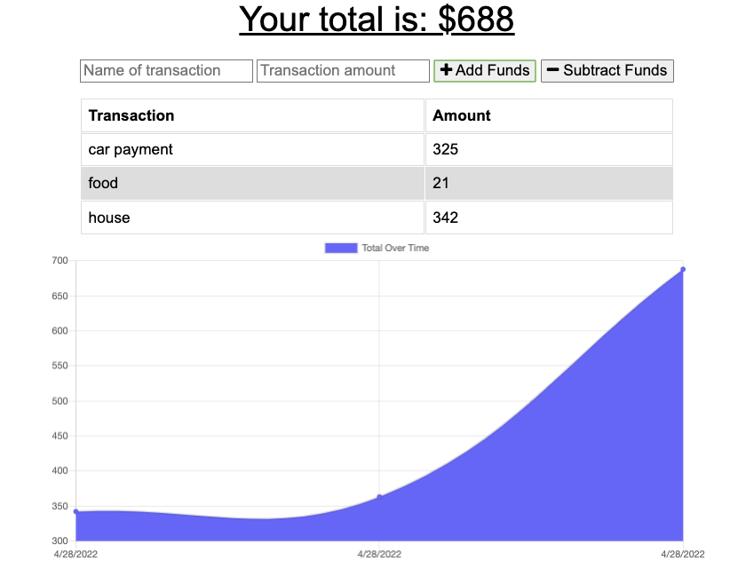

  # budget-tracker [](http://unlicense.org/)
  
  ## Description
  This is an application that keeps track of your expenses. Simply add an item and price and click add expense. To subtract and expense, add a name and total and click subtract expense. Using Charts.js, your data is graphed. This uses a MongoDB database structure and is hosted on Heroku. This application is also a PWA and makes use of indexedDB, service workers to remain functional online, and includes a manifest json file to download from the web browser to your home screen. 
  ## Tables of Contents
  1. [Installation](#installation)
  2. [Usage](#usage)
  3. [Contribution](#contribution)
  4. [Tests](#tests)
  5. [License](#license)
  6. [Questions](#questions)
  ## Installation
  To install the necessary dependencies, run the following command.
  ```
  npm i
  ```
  ## Usage
  Not all of the data will be saved when offline since active fetch request are used to populate the charts. However, you are still able to add adn subtract expenses even when offline.  [How To Video](NA)
  ## Contribution
  Fork and make a pull request
  ## Tests
  ```
  NA
  ```
  ## License 
  This applicaiton is licensed under the The Unlicense license.
  ## Questions
  If you have any questions:

  [GitHub Acccount](https://github.com/abarragan89)

  Email: anthony.bar.89@gmail.com
